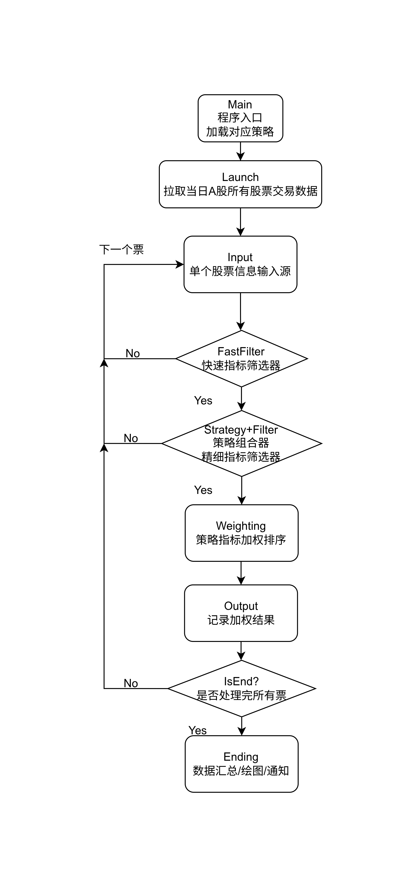

# 梓鸣的A股股票筛选器(持续施工中)

这个项目的使用场景是替代如`通达信`,`同花顺`,`东方财富`等理财选股软件的股票筛选功能(或所谓的动态筛选)，提供自定义程度更高、个性化程度更好的选股工具，方便个人验证自己交易策略多赚钱少亏钱的成功率。

目的是为了快速筛选出符合B1/B2/砖形图趋势的股票。
核心指标来源于Z哥提出的相关概念。

主要使用`akshare`[git@github.com:akfamily/akshare.git]作为数据来源
主要以东方财富的数据源为主。

尝试引入(不分先后)
1. `Sqeuoia-X`[git@github.com:sngyai/Sequoia-X.git]
2. `aktools`[git@github.com:akfamily/aktools.git]
3. `akquant`[git@github.com:akfamily/akquant.git]
...
作为加速筛选更美股票的工具。

# 程序结构

这个程序逻辑如下所示:
